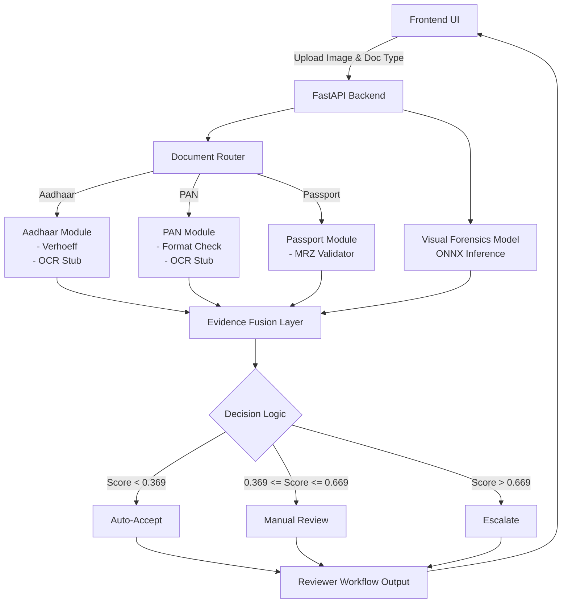

# TrustID Architecture

```mermaid
graph TD
    Client[Frontend UI] -->|Upload Image & Doc Type| API[FastAPI Backend]
    
    API --> Router[Document Router]
    
    Router -->|Aadhaar| AadhaarMod[Aadhaar Module\n- Verhoeff\n- OCR Stub]
    Router -->|PAN| PANMod[PAN Module\n- Format Check\n- OCR Stub]
    Router -->|Passport| PassMod[Passport Module\n- MRZ Validator]
    
    API --> Visual[Visual Forensics Model\nONNX Inference]
    
    AadhaarMod --> Fusion[Evidence Fusion Layer]
    PANMod --> Fusion
    PassMod --> Fusion
    Visual --> Fusion
    
    Fusion --> Logic{Decision Logic}
    Logic -->|Score < 0.369| Accept[Auto-Accept]
    Logic -->|0.369 <= Score <= 0.669| Review[Manual Review]
    Logic -->|Score > 0.669| Escalate[Escalate]
    
    Accept --> Response[Reviewer Workflow Output]
    Review --> Response
    Escalate --> Response
    
    Response --> Client
```
